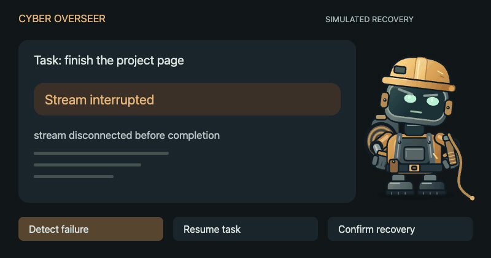
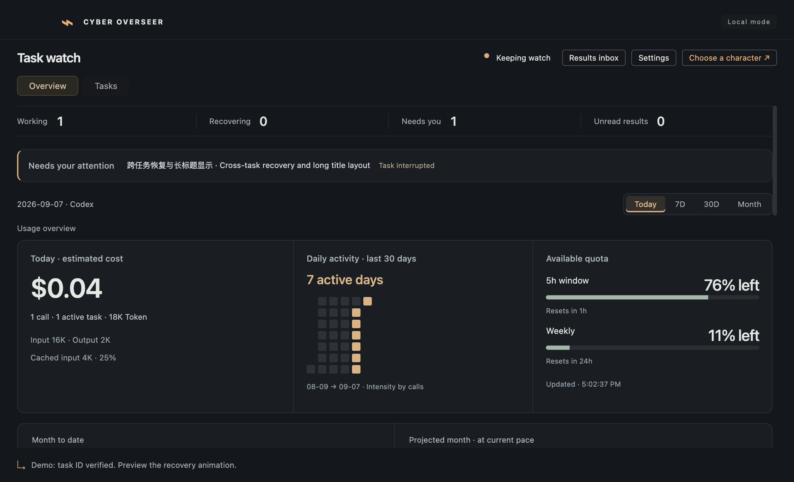
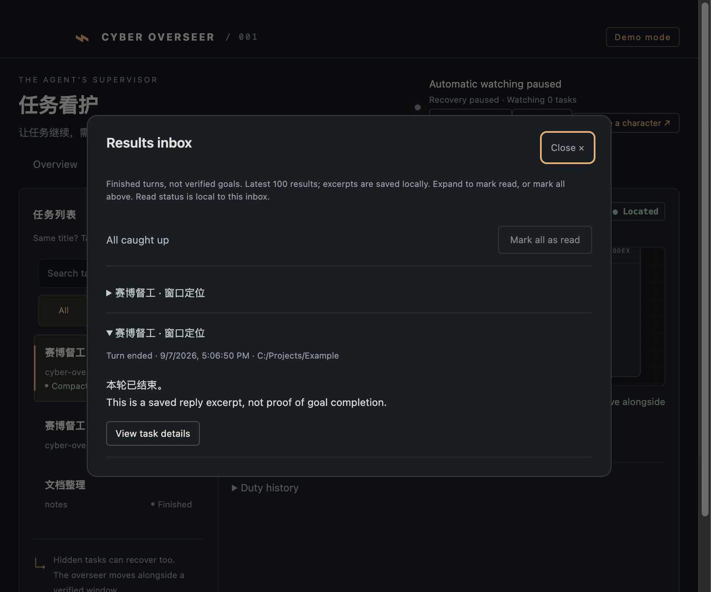

<div align="center">


# Cyber Overseer

[简体中文](README.md) · **English**

### Step away. Your overseer stays on duty.

A desktop companion that keeps watch over Codex Desktop.<br>
Resume interrupted tasks, attempt recovery from compaction failures, and collect results in an inbox.

**Zero-token monitoring · Overnight watch · Keep your plan moving · Four companions**

[Get started](#get-started) · [Meet the crew](#meet-the-crew) · [Features](#features) · [FAQ](#faq)

<sub>Experimental Alpha · macOS Apple Silicon / Windows x64</sub>

</div>

**Get that drink. Don’t leave your task at `Reconnecting 5/5`.** The overseer discovers open local Codex root tasks, checks failures, and sends `continue` to the original task.



*A 12-second simulated flow using the app’s character animations. This is not a recording of Codex or evidence of real recovery.*

## Get started

### macOS app

If you have the DMG, open it, drag **Cyber Overseer.app** into **Applications**, and launch it. Keep Codex Desktop running and signed in. The app bundles its runtime dependencies; you do not need to install Node.js or Python separately.

**[Download the macOS preview DMG](https://github.com/tianwdong/cyber-overseer/releases/tag/v0.1.2)** · Apple Silicon · approximately 130 MiB. Not notarized. See [App and DMG packaging](docs/packaging.md) for installation and build details (Chinese).

### Windows app

**[Download the Windows x64 preview installer](https://github.com/tianwdong/cyber-overseer/releases/tag/v0.1.3)**. Run the `.exe` and choose an installation directory. Python and SQLite are bundled; no separate Node.js or Python installation is needed. The installer supports English and Chinese, with removal through Windows Settings.

The installer is unsigned and Windows may show a reputation warning. Real Codex recovery and multi-monitor desktop behavior still need Windows validation. See [Windows support status](docs/windows-support.md) (Chinese).

### Run from source

You need Node.js 24+, Python 3.9+ with `sqlite3`, and a signed-in Codex Desktop. From the project directory:

```sh
npm ci
npm start
```

To explore the companions and dashboard first, run `npm run dev`. The demo uses simulated tasks and sends no requests to real tasks.

Automatic monitoring is enabled on first launch. Click the companion to open settings and adjust retries or language. The language follows Codex by default. Closing the dashboard leaves the overseer running in the system tray; use the tray menu to quit.

Version 0.1.2 includes **app update reminders**. It checks about every six hours and matches installers to your OS and architecture. Check manually or disable automatic checks in Settings. Read the release notes and install when convenient; checking does not interrupt your tasks. [Update behavior and privacy](docs/app-updates.md)


## Rest while your plan keeps moving

**Monitoring itself uses 0 tokens.** Failure detection runs locally without additional model calls. Resumed Codex work still consumes tokens and quota as usual.

**Keep watch overnight.** Leave your task with Codex; the overseer keeps checking for explicit stream and compaction failures and attempts recovery within your retry limit. Your computer must stay awake with both apps running. It does not wake a sleeping computer or bypass approvals or quota limits.

**Keep the plan in its original task.** Recovery targets the same task and retains its context, model, and approval settings, reducing the need to explain your plan again after an interruption. This is not a plan backup or a recovery guarantee.

## Features

### A task stops. The overseer steps in.

Network interruptions, temporary model capacity errors, and compaction failures follow their own recovery rules. The default is **3 attempts including the first**, configurable from 1 to 10. Counts are separate for each task and survive restarts. Newly opened tasks are picked up automatically, even when you switch windows.

Healthy tasks, manual stops, and approval waits do not trigger recovery. Pause one task or all of them. If a receipt is uncertain, wait for state confirmation before considering another request. [Recovery rules](docs/usage-guide.md#它什么时候会出手) (Chinese)

### Know how much quota is left.

The food bowl and battery gauge follow the most constrained quota window on your account. Open the overview for estimated costs, tokens, activity, and project rankings. Select a day to explore its models and tasks.



*UI demo. Costs are price-table estimates, not subscription charges. Quota is shown separately.*

### Come back to your results.

The results inbox keeps final reply excerpts. Expand an entry to mark it read, or mark the current batch together. The duty log distinguishes sent requests from confirmed recovery; system notifications can prompt you when input is needed or retries are exhausted.

<details>
<summary>View the results inbox demo</summary>



</details>

## Meet the crew


| Companion | On duty |
| --- | --- |
| **The Foreman** | Taps a boot, swings a cable whip, and watches for work to resume. |
| **The Medic** | Checks the monitor, runs a diagnostic probe, and charges up to help a stalled task. |
| **The Repair Cat** | Patrols on four paws, reaches for cables, and crouches for repairs. Its food bowl shows your remaining quota. |
| **The Patrol Drone** | Hovers, scans, and fires a pulse to get things moving. |

**Put them where you like.** Hold to pick up, then drag into place. Drop a companion against either side of the screen and it tucks its body away, peeking out while it keeps watch. Its position survives a restart.

**The food and battery gauges mean something.** They follow the most constrained quota window on your Codex account. Hover for details, click to open the dashboard, or right-click to switch companions and control monitoring.

## FAQ

**Which platforms are supported?** The current integration is local Codex Desktop. Preview downloads include an Apple Silicon app/DMG and a Windows x64 installer. Real Windows Codex recovery remains unverified. Claude, Grok, remote tasks, and Intel app packages are not available yet.

**Does it change my Codex settings?** Recovery targets the full task ID, reads task databases and logs without modifying them, and preserves the original model and approval settings. The internal protocol adapter is experimental and needs compatibility checks after Codex updates.

**What does it store or cost?** Detection needs no additional model calls; resumed work uses the original task’s quota. The local inbox retains up to 100 results with reply excerpts of up to 1,600 characters. Read status is independent of Codex. [Storage details](docs/usage-guide.md#数据留在哪里) (Chinese)

**Can I leave it completely unattended?** This is still an Alpha. Monitoring starts automatically; click the companion to configure or pause it. See the bilingual [validation record](docs/validation.md) for known limitations and the distinction between simulated and real tests.

## Help improve it

The most useful contributions right now are Windows validation, Codex version compatibility checks, reproducible failure reports, and character animation improvements. Include your OS and Codex versions, reproduction steps, and redacted error text. Do not upload raw databases or conversation logs.

```sh
npm run typecheck       # Type checking
npm test                # Core and protocol tests
npm run smoke           # Electron exercises with an isolated test profile
npm run package:mac     # Build a local Apple Silicon app and DMG
```

Further documentation is currently in Chinese:

[Usage guide](docs/usage-guide.md) · [Usage methodology](docs/usage-overview.md) · [Pricing maintenance](docs/pricing.md) · [Results inbox](docs/completion-inbox.md) · [Technical approach](docs/research/2026-09-06-technical-route.md)


## License

Source code is licensed under [MIT](LICENSE). Original character artwork is all rights reserved; see [asset terms](assets/ASSET-LICENSE.md). Third-party material retains its own terms; see [NOTICE](assets/CODEBURN-NOTICE.txt).
