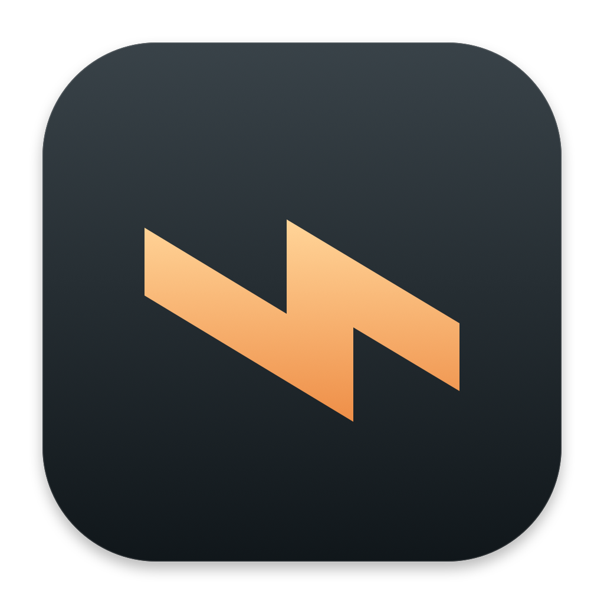
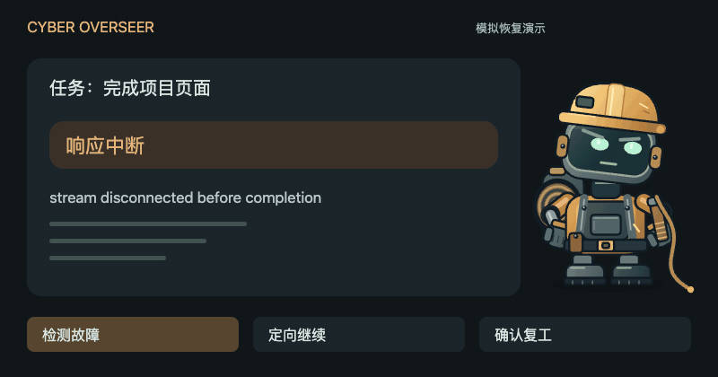
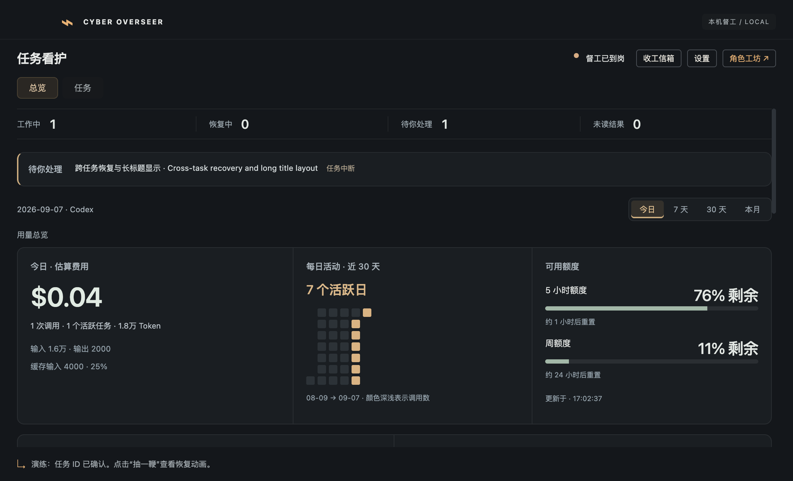
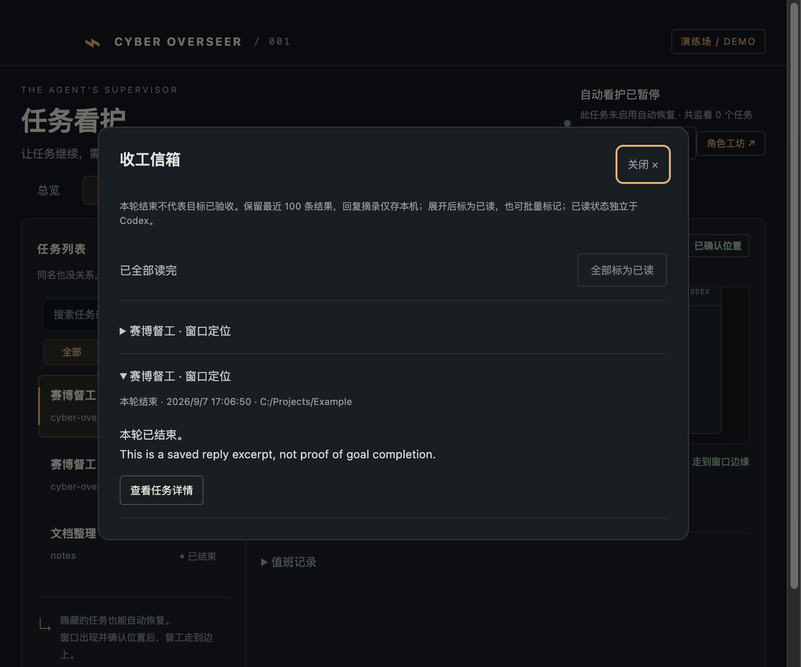
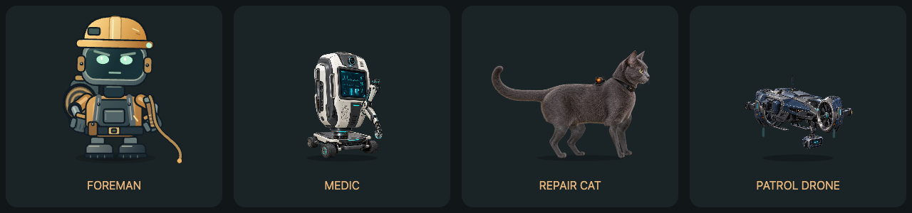

<div align="center">



# Cyber Overseer · 赛博督工

**简体中文** · [English](README.en.md)

### 你去忙，督工盯着。

给 Codex Desktop 一个会值班的桌面伙伴。<br>
断流后自动续跑，压缩异常时尝试恢复，收工结果留在信箱。

**0 Token 值守 · 夜间看护 · 守住你的 Plan · 四位桌面伙伴**

[开始使用](#开始使用) · [认识督工](#谁来值班) · [能做什么](#能做什么) · [常见问题](#常见问题)

<sub>实验性 Alpha · macOS Apple Silicon / Windows x64</sub>

</div>

**你去倒杯水，别让任务停在 `Reconnecting 5/5`。** 督工自动发现本机已打开的 Codex 根任务，核对故障后，替你向原任务发送 `continue`。



*12 秒模拟流程演示，复用应用角色动画；不是实际 Codex 窗口录像或真实恢复验收证据。*

## 开始使用

### macOS App

已有 DMG 时，双击打开，将 **Cyber Overseer.app** 拖入 **Applications**，再启动应用。保持 Codex Desktop 已运行并登录即可；App 内置运行依赖，无需另装 Node.js 或 Python。

**[下载 macOS 预览版 DMG](https://github.com/tianwdong/cyber-overseer/releases/tag/v0.1.11)** · Apple Silicon · 约 130 MiB。尚未公证；安装与自行构建见 [App 与 DMG 打包](docs/packaging.md)。

### Windows App

**[下载 Windows x64 预览版安装程序](https://github.com/tianwdong/cyber-overseer/releases/tag/v0.1.11)**。运行 `.exe`，选择安装目录即可；内置 Python／SQLite，无需另装 Node.js 或 Python。支持中英文安装界面，可从 Windows 设置卸载。

安装包尚未代码签名，Windows 可能显示信誉提示。真实 Codex 故障恢复与多屏桌面行为仍待 Windows 真机验收，详见 [Windows 支持状态](docs/windows-support.md)。

### 从源码运行

需要 Node.js 24+、Python 3.9+（含 `sqlite3`）及已登录的 Codex Desktop。在项目目录运行：

```sh
npm ci
npm start
```

想先看看角色和面板，可以运行 `npm run dev`。演练使用模拟任务，不向真实任务发送指令。

首次启动默认开启自动看护；单击角色进入设置，调整重试次数和语言。语言默认跟随 Codex。关闭面板后继续在托盘值班，从托盘退出才会结束程序。

0.1.11 已支持**应用内自动下载更新**：约每 6 小时检查一次，按当前系统与架构匹配安装包；设置里可手动检查或关闭自动检查。发现新版本后自动下载并校验安装包，完成后可点击“打开安装包”，不打断正在运行的任务。[更新机制与隐私说明](docs/app-updates.md)


## 你休息，Plan 继续

**值守本身 0 Token。** 故障检测在本机运行，不调用额外模型；恢复后的 Codex 任务仍按原有方式消耗 Token 和额度。

**夜间也能看护。** 睡前把任务交给 Codex，督工持续检测明确的断流和压缩异常，在重试上限内尝试恢复。需要电脑保持唤醒、Codex 与督工持续运行；不会自动唤醒睡眠中的电脑，也不会越过审批或额度限制。

**守住原任务里的 Plan。** 恢复定向发给原任务，沿用它的上下文、模型和审批设置，减少中断后重新交代计划的次数。这不是计划备份或恢复保证。

## 能做什么

### 平时一眼知道进展

悬停角色可看当前任务、正在执行的活动与剩余额度，点击打开对应 Codex 任务。新结果送到桌面入口，展开后同步消除未读标记；角色在工作期间保持轻微、间歇动作。费用总览保留已计价部分，缺少价格的模型单独注明，不阻断其他金额统计。

### 任务断了，自动接上

网络断流、模型暂时满载、压缩异常，各自按规则处理。默认最多恢复 **3 次，含首次**，可设置为 1–10 次；每个任务独立计数，重启后保留。新打开的任务自动纳入，切换窗口不影响看护。

正常运行、人工停止和等待批准不会触发恢复。可以暂停单个任务或暂停全部；发送后回执不明时，先等待读回确认。[查看恢复规则](docs/usage-guide.md#它什么时候会出手)

### 额度剩多少，一眼看见

猫粮、电量反映账户中限制最紧的额度窗口。打开总览，可以查看费用估算、Token、活动趋势和项目排行；点开日期继续看模型与任务明细。



*界面演练截图。费用按价格表估算，不是订阅账单；额度单独显示。*

### 任务收工，回来查看

收工信箱保存最后回复摘录，展开标为已读，也能批量处理。值班记录告诉你请求是否发出、是否确认复工；需要输入或重试耗尽时，可通过系统通知提醒你。

<details>
<summary>查看收工信箱演练截图</summary>



</details>

## 谁来值班



| 督工 | 值班风格 |
| --- | --- |
| **暴躁工头** | 敲鞋尖、挥电缆鞭，盯到任务重新开工。 |
| **急救机器人** | 心电观察、探头诊断、电极充能，给停下来的任务搭把手。 |
| **磁力维修猫** | 四足巡场、探爪扒线、伏身检修。猫粮碗显示你的剩余额度。 |
| **喷气巡警** | 悬停巡查、信标扫描、脉冲助推，守着工作区。 |

**放在你顺手的地方。** 按住提起，拖动摆放；靠近左右屏幕边缘松手，它会藏好身体，探出头继续值班。位置会在下次启动时保留。

**猫粮和电量有实际意义。** 它们跟随 Codex 账户中限制最紧的额度窗口变化。悬停查看详情，单击打开面板，右键切换角色或控制看护。

## 常见问题

**支持哪些平台？** 当前接入本机 Codex Desktop。Apple Silicon 提供 App／DMG，Windows x64 提供安装程序；Windows 真实故障恢复仍待验收。Claude、Grok、远程任务和 Intel 安装包尚未提供。

**会改动我的 Codex 设置吗？** 按完整任务 ID 定向恢复，只读任务数据库与日志，保留原模型和审批设置。内部协议属于实验性适配，Codex 升级后需要复核兼容性。

**会保存什么、产生什么费用？** 自动判断无需额外模型调用，继续执行会使用原任务额度。信箱本地保留最近 100 条结果及最多 1,600 字符的回复摘录，已读状态独立于 Codex。[数据与保留说明](docs/usage-guide.md#数据留在哪里)

**能完全放着不管吗？** 当前仍是 Alpha。默认自动开启看护，单击角色可设置或暂停。已知限制及模拟／实机证据见 [验证记录](docs/validation.md)。

## 一起打磨

最需要的帮助：Windows 真机验收、Codex 版本兼容验证、故障复现，以及角色动作打磨。反馈请附系统与 Codex 版本、复现步骤和脱敏错误文字；不要直接上传原始数据库或对话日志。

```sh
npm run typecheck       # 类型检查
npm test                # 核心与协议测试
npm run smoke           # 独立配置下的 Electron 演练
npm run package:mac     # 构建本地 Apple Silicon App 与 DMG
```

[使用指南](docs/usage-guide.md) · [统计口径](docs/usage-overview.md) · [价格表维护](docs/pricing.md) · [收工信箱](docs/completion-inbox.md) · [技术路线](docs/research/2026-09-06-technical-route.md)


## 许可

源码采用 [MIT](LICENSE)。原创角色素材保留所有权利，具体范围见 [素材许可](assets/ASSET-LICENSE.md)。第三方内容适用各自声明，见 [NOTICE](assets/CODEBURN-NOTICE.txt)。

### CLI 看护（0.1.8，实验性）

在面板点击“启动 CLI”，选择项目目录，使用原生 Codex 终端。督工自动发现通过该入口启动的根任务，对明确的网络、压缩故障尝试发送 `continue`；普通已打开的 CLI 终端不会自动接管。需要支持认证 `--remote` 的 Codex CLI（协议按 0.153.4 核对）。关闭督工不会主动停止终端。Windows 真实故障恢复与 CLI 窗口精确定位仍待验收。
